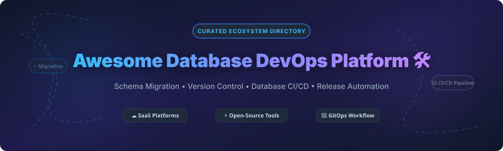
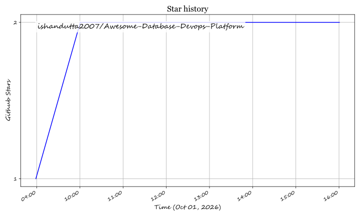

# Awesome Database DevOps Platform 🛠️

  

  
  
  
  
  

## 📌 Top Database DevOps Platforms Ecosystem

**Curated List of SaaS Platforms & Open-Source GitHub Projects**

*Focused on Schema Migration, Version Control, Database CI/CD, Declarative Schema-as-Code & Release Automation*

**Last updated: October 2026**

---

### 🚀 Overview & Key Categories

This repository tracks notable **SaaS platforms** and **open-source projects** for **Database DevOps**. These tools enable DBAs, backend developers, and platform teams to apply modern software engineering practices—version control, automated testing, continuous integration and delivery (CI/CD), security-as-code, and code review—to database schema changes and releases.

Key industry examples include **Liquibase**, **Flyway**, **Redgate SQL Change Automation**, **Bytebase**, **Atlas**, **SchemaHero**, **DBmaestro**, **Sqitch**, **Prisma Migrate**, **Drizzle Kit**, **golang-migrate**, **gh-ost**, and **Neon Branching**.

---

## 💡 Market Insights & Industry Overview

> 📊 **Estimated Market Size**: The global Database DevOps and Schema Change Management market is estimated at **$1.8 Billion – $2.5 Billion (2025/2026)** with an annual growth rate (CAGR) of over 18%. 
> 
> 🧩 **Market Fragmentation**: The sector is **moderately fragmented**. Legacy enterprise database platforms (e.g., Redgate, Liquibase, DBmaestro) dominate traditional SQL Server and Oracle environments, while agile serverless cloud database platforms (Neon, PlanetScale) and open-source declarative schema-as-code frameworks (Atlas, Bytebase, Prisma) are rapidly consolidating developer-centric GitOps workflows.

---

## ☁️ SaaS / Hosted Platforms

Below is a curated summary of enterprise SaaS platforms offering managed database release automation, branching, and CI/CD pipelines, sorted by company revenue/valuation in descending order.

| Platform 🛠️ | Scale / Valuation 💰 | Starting Price 🏷️ | Free Tier / Trial Limit 🎁 | Core Capabilities & Overview ℹ️ |
| :--- | :--- | :--- | :--- | :--- |
| **[PlanetScale](https://planetscale.com/)** | **$1.0 Billion** Valuation (Series D) | **$39/month** (Scalers Plan) | 14-day free trial on Scalers plan (includes MySQL Vitess branching & schema diffs) | MySQL database branching built on Vitess. Deploy requests generate schema diffs for team pull-request reviews with zero downtime. |
| **[Neon Branching](https://neon.com/)** | **$1.0 Billion** Valuation (Acquired by Databricks) | **$19/month** (Launch Plan) | Free Forever: 0.5 GB storage, 10 branches per project, 1 project | Instant copy-on-write database branching for PostgreSQL. Branches are created instantly without copying base data. |
| **[Redgate Flyway Enterprise](https://www.red-gate.com/products/flyway/enterprise/)** | **$100 Million+** Annual Recurring Revenue (ARR) | **$595/user/year** (Flyway Teams) | Free Community Edition (basic migrations); 28-day free enterprise trial | Enterprise-grade schema drift detection, automated undo script generation, policy checks, and object-level versioning. |
| **[ApexSQL DevOps](https://www.apexsql.com/)** | **~$55 Million** ARR (Idera Inc.) | **$1,499/license** (ApexSQL Suite) | 14-day full feature free trial | SQL Server database DevOps toolkit for schema/data comparison, build automation, continuous integration, and script execution. |
| **[DBmaestro](https://www.dbmaestro.com/)** | **$9.5 Million** Total Funding Raised | **$3,000/year** (Starting per pipeline target) | 14-day free trial | State-based database release automation checking pre- and post-deployment schema state for Oracle, SQL Server, MySQL, and Postgres. |
| **[Bytebase Cloud](https://bytebase.com/)** | **$3.0 Million** Seed Funding Raised | **$20/user/month** (Pro Plan) | Free Forever: up to 20 users and 10 database instances | Web-based database CI/CD platform (CNCF Landscape) with 200+ SQL lint rules, approval workflows, GitOps, and data masking. |
| **[Liquibase Secure](https://www.liquibase.com/)** | Private Enterprise Tier | **$350/target DB/year** (Starter Tier) | Free Community Edition (Open Source); 30-day free trial | Enterprise compliance mapping (SOX, PCI DSS, DORA), automated policy checks, RBAC governance, and structured rollbacks. |

---

## ⚡ Open-Source GitHub Projects

The open-source ecosystem for Database DevOps is mature, battle-tested, and rapidly expanding. Below are top open-source tools sorted by **GitHub Stars_Count (descending)**.

- **[Prisma Migrate](https://github.com/prisma/prisma)**  🌟
  Hybrid declarative/imperative migration engine built into Prisma ORM. Uses declarative `.prisma` schemas to generate versioned SQL migration scripts.
  
- **[Drizzle Kit](https://github.com/drizzle-team/drizzle-orm)**  🌟
  TypeScript-first declarative database migration tool and CLI for Drizzle ORM supporting PostgreSQL, MySQL, and SQLite.

- **[golang-migrate](https://github.com/golang-migrate/migrate)**  🌟
  CLI and Go library for imperative database migrations supporting 20+ driver targets (Postgres, MySQL, Redshift, Spanner, SQLite).

- **[Bytebase](https://github.com/bytebase/bytebase)**  🌟
  The only database CI/CD project in the CNCF Landscape. Provides web-based GitOps schema collaboration, SQL linting, and role-based access control.

- **[gh-ost](https://github.com/github/gh-ost)**  🌟
  GitHub's online, triggerless schema migration engine for MySQL that operates without locking tables or interrupting live traffic.

- **[Flyway](https://github.com/flyway/flyway)**  🌟
  The popular SQL-first imperative migration tool supporting 50+ database systems. Uses versioned SQL files (`V1__init.sql`) and history tracking tables.

- **[Atlas](https://github.com/ariga/atlas)**  🌟
  Declarative schema-as-code tool bringing Terraform-like workflows to database management with HCL/SQL schemas, 50+ safety lint analyzers, and drift detection.

- **[Liquibase](https://github.com/liquibase/liquibase)**  🌟
  Cross-database abstraction migration framework. Supports changelogs written in SQL, XML, YAML, or JSON with built-in rollback execution and 60+ database drivers.

- **[Sqldef](https://github.com/k0kubun/sqldef)**  🌟
  Idempotent declarative schema management CLI tool for MySQL, PostgreSQL, SQLite, and SQL Server using plain `CREATE TABLE` definitions.

- **[Sqitch](https://github.com/sqitchers/sqitch)**  🌟
  VCS-centric dependency-graph migration framework without version numbers. Features explicit deploy, revert, and verify test scripts.

- **[Reshape](https://github.com/fabianlindfors/reshape)**  🌟
  An open-source database migration tool for Postgres that performs zero-downtime schema changes using automated views and dual-write patterns.

- **[Skeema](https://github.com/skeema/skeema)**  🌟
  Pure-SQL declarative schema management CLI for MySQL and MariaDB that integrates seamlessly with Git workflows.

- **[SchemaHero](https://github.com/schemahero/schemahero)**  🌟
  Kubernetes-native operator that declarative converts custom resource definitions (CRDs) into table schemas and executes automated `ALTER TABLE` migrations.

---

## 🤝 How to Contribute

1. 🍴 Fork this repository.
2. ✍️ Add or update entries in `README.md` maintaining standard formatting.
3. 📝 Ensure accuracy for product descriptions, licensing, and pricing.
4. 📬 Submit a Pull Request (PR) with a brief summary of additions.

---

## 📈 Star History

---

## 💖 Support & Community

Thank you for exploring and contributing to the **Awesome Database DevOps Platform** ecosystem! 

If you find this repository helpful:
- ⭐ **Star** this repository to show your appreciation!
- 🔀 **Fork** it to keep your own reference copy.
- 📢 **Share** it with fellow DBAs, DevOps engineers, and developers.

---

## ⚠️ Disclaimer

- This list is community-curated for informational purposes and does not constitute official vendor endorsement.
- Always verify schema scripts and security compliance before applying changes in production environments.

---

**Made with ❤️ for Database Engineers, Platform Teams, and DevOps Practitioners worldwide.**

## ⭐ Star History

<a href="https://star-history.com/#ishandutta2007/Awesome-Database-Devops-Platform&Timeline" align="center">
  <picture>
    <source media="(prefers-color-scheme: dark)" srcset="assets/ishandutta2007_Awesome-Database-Devops-Platform_growth.svg">
    
  </picture>
</a>
